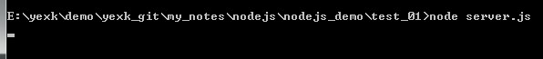

# Node.js
> node 配置，安装的过程就免了。傻瓜式安装。
> node nvm 安装。

## 快速入门
> node.js 在这里充当一门后台语言，“接收HTTP请求的并提供web页面”的操作。

快速入门
- 引入 required 模块：我们可以使用 require 指令来载入 Node.js 模块。
- 创建服务器：服务器可以监听客户端的请求，类似于 Apache 、Nginx 等 HTTP 服务器。
- 接收请求与响应请求 服务器很容易创建，客户端可以使用浏览器或终端发送 HTTP 请求，服务器接收请求后返回响应数据。
> 淘宝的npm镜像： npm install -g cnpm --registry=https://registry.npm.taobao.org

### 第一步：引入 required 模块，并且在你的项目根目录创建一个server.js文件。
~~~JavaScript
var http = require('http');
http.createServer(function(request,response) {
	response.writeHead('200', {'Content-Type': 'text/plain'});
	response.end('Hello Yexk!');
}).listen(5210);
~~~

打开对应的目录，使用命令：`node server.js`

访问显示结果：

