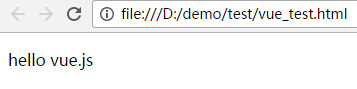

# Vue.js 

## 简介
> Vue.js（读音 /vjuː/, 类似于 view） 是一套构建用户界面的渐进式框架。
> Vue 只关注视图层， 采用自底向上增量开发的设计。
> Vue 的目标是通过尽可能简单的 API 实现响应的数据绑定和组合的视图组件。

快速入门
```HTML
<!DOCTYPE html>
<html lang="en">
<head>
	<meta charset="UTF-8">
	<title>Document</title>
	<script src="node_modules/vue/dist/vue.js"></script>
</head>
<body>
	<p id="ye">{{ demo }}</p>

	<script>
		new Vue({
			el:"#ye", // 获取元素的id，class，类同css选择器。
			data:{
				demo:'hello vue.js' // 对页面的变量进行渲染
			}
		});
	</script>
</body>
</html>
```
结果：



