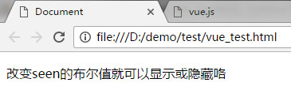
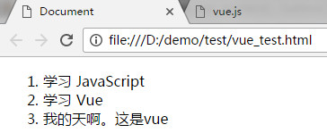

# Vue.js 

## 简介
> Vue.js（读音 /vjuː/, 类似于 view） 是一套构建用户界面的渐进式框架。
> Vue 只关注视图层， 采用自底向上增量开发的设计。
> Vue 的目标是通过尽可能简单的 API 实现响应的数据绑定和组合的视图组件。

快速入门
```HTML
<!DOCTYPE html>
<html lang="en">
<head>
	<meta charset="UTF-8">
	<title>Document</title>
	<script src="node_modules/vue/dist/vue.js"></script>
</head>
<body>
	<p id="ye">{{ demo }}</p>

	<script>
		new Vue({
			el:"#ye", // 获取元素的id，class，类同css选择器。
			data:{
				demo:'hello vue.js' // 对页面的变量进行渲染
			}
		});
	</script>
</body>
</html>
```

结果： 


#### 条件语句 ` v-if `
```HTML
<div id="app-1">
  <p v-if="seen">改变seen的布尔值就可以显示或隐藏咯</p>
</div>
<script>
	var app1 = new Vue({
	  el: '#app-1',
	  data: {
	    seen: true
	  }
	})
</script>

```
结果： 



#### 循环语句 ` v-for `
```HTML
<div id="app-2">
  <ol>
    <li v-for="demo in demos">
      {{ demo.text }}
    </li>
  </ol>
</div>
<script>
var app2 = new Vue({
  el: '#app-2',
  data: {
    demos: [
      { text: '学习 JavaScript' },
      { text: '学习 Vue' },
      { text: '我的天啊。这是vue' }
    ]
  }
})
</script>
> Tips: v-for="(value,key,index) in Object" 可以带三个参数进行

```
结果： 



> `Tips` : v-bind指令可以缩写为一个冒号，v-on指令可以缩写为@符号。