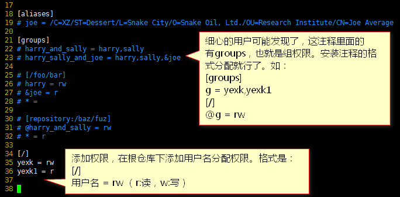

[TOC]

## 安装后的SVN配置
> 我们一般在linux都安装了svn，然后通过svn来管理代码。安装教程就赘述了，基本就是解压-编译-编译-安装。这里我讲svn安装完后的配置仓库方法。

### 创建目录
> 仓库目录创建在哪里都可以。只要你能找到，就ok。
> 例：/usr/local/svn/yexk_test

命令：`mkdir yexk_test`


### 创建仓库
进入`yexk_test`目录创建仓库。
命令：`svnadmin create . `（注意后面有点，指到当前目录）

> 查看目录，可以发现已经多了，conf、db、hooks等目录或文件。

### 配置仓库
配置文件都在`conf`目录下。分别是`svnserve.conf`、`passwd` 、`authz`。
1) 打开读写权限控制
编辑`svnserve.conf`文件。安装图修改，修改后保存退出。

> 注意：anon-access=read 必须打开，并且改成none，不然任何人都可以下载代码了。同时要注意配置前面不要有空格。
> password-db 和 authz-db 的这两个文件是可以重新定义的。如果你有需求改成多仓库统一配置就需要改目录位置。

2）创建用户密码
编辑`passwd`文件。添加用户。保存退出。

> 创建格式是：用户名 = 密码

3）分配权限
编辑`authz`文件。

> 根据权限或者权限组来分配对应的读写权限。

这里配置就已经完成了。最后启动服务就行了。

### 启动svn
命令：`svnserve -d -r /usr/local/svn/`(-d:服务在后台进行,-r:把后面的目录当成根目录运行)

接下来就可以访问请求了。
`svn checkout svn://IP地址/仓库目录/`
> 输入账号密码就可以。


启动后我先说题外话，一般用户配置的仓库都不会是单一个的。所以这里就有多仓库的问题了。我该怎么启动svn。
比如我这里的仓库目录是`/usr/local/svn/yexk_test`，一般不推荐把服务根目录挂在仓库同级下。
也就是不推荐`svnserve -d -r /usr/local/svn/yexk_test/`这样启动服务。
如果有需求需要添加第二个仓库，那么这个时候就有点麻烦了。

### 自动同步（非必要）
> 此步骤仅仅为了线上环境可以和web文件同步。
> 自动同步文件是在hooks目录下的一个post-commit文件。

1） 进入到仓库目录下的`hooks`目录。
2） 复制一份`post-commit.tmpl`文件，并且重名为`post-commit`。
	命令：`cp post-commit.tmpl post-commit`
3） 分配755权限。
	命令：`chmod 755 post-commit` 
4） 添加一段代码，用于自动更新代码到web仓库。
	```
	EPOS="$1"
	REV="$2"
	export LANG=en_US.UTF-8
	WEB_PATH=/www/yexk_test/ # web项目地址
	SVN_USER=yexk # svn用户名
	SVN_PASS=admin # svn密码
	LOG_PATH=/tmp/svn_yexk.log # 日志文件。可以忽略
	echo `date "+%Y-%m-%d %H:%M:%S"` >> $LOG_PATH # 日志文件。可以忽略
	echo `whoami`,$REPOS,$REV >> $LOG_PATH # 日志文件。可以忽略
	svn update $WEB_PATH --username $SVN_USER --password $SVN_PASS --no-auth-cache >> $LOG_PATH 
	# 如果忽略了日志文件最后的输出就免了。
	```

