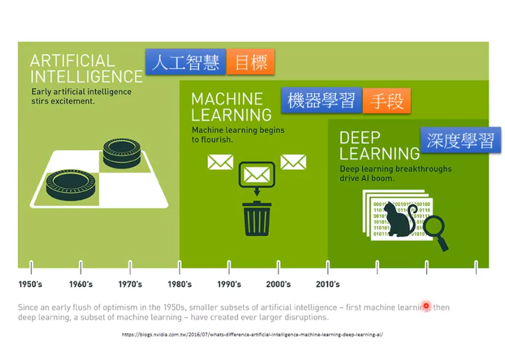
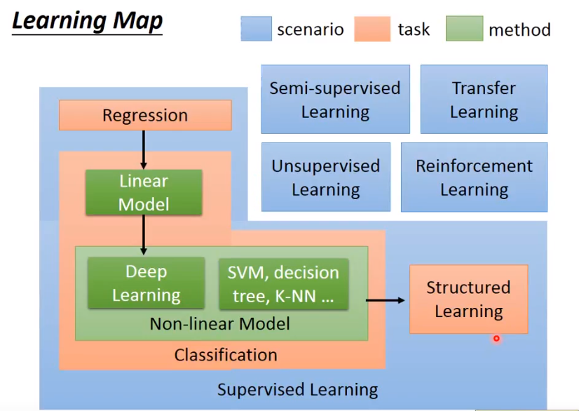

# 深度学习 Python

最近对深度学习挺有兴趣的。但是发现这个门槛有点高，各种什么回归，梯度完全没听过。终于知道自己和大学生差在哪里了。所以最近就想试试自己到底能不能搞定这个深度。顺便把我所学的所有东西分享给你们。也让其他非专科生学习的人可以没有门槛。

- 什么是深度学习？
- 深度学习能够带来什么？
- 什么人群可以学习？我可以吗？

说说话我现在还不能给回答这个问题。因为我也是带着这些问题去学习的。可能会遇到不少弯路。但学习到现在也找到了“师傅”，现在看看该怎么学习吧。

首先先确定自己到底有么有兴趣！

建议先去听听  这个也算是我的第一个老师。后续会经常出现。我也只看到了p5。

从这个图可以不难发现其实深度学习是有前提的，需要学习深度学习，就得先了解什么是机器学习。这里我不会再复述到视频的内容。毕竟我没有老师专业。我只告诉你们我是怎么学的。顺便把学习过程记录下来。

To be continue..