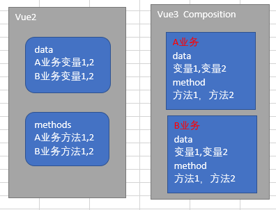

# 第五期: 成人网站 Pornhub 技术栈首度公开

## 行内新闻

- [成人网站 Pornhub 技术栈首度公开](https://www.infoq.cn/article/vdxabhV4JX1eeAMTa2XR)
- [全球IPv4地址耗尽，中国IPv6新体系正在形成](https://www.ithome.com/0/459/281.htm)
- [Java 失宠，谷歌宣布 Kotlin 现在是 Android 开发的首选语言](https://www.infoq.cn/article/qt51vqATE7jf_bpw5ggJ)
- [“腾讯QQ”微信小程序由“QQ空间时光机”改名而来](https://www.ithome.com/0/459/235.htm)

## 前端技术

如今的开发根本不算什么难题，只要会html,css,js就能够做出一个前端页面了。再会点后端语言，基本一个项目就做出来了。没人多少会去注意到底这个项目会不会用户体验不好？或者说从代码程度上理解会不会很不好。优化？那种东西更是不存在的，每天都赶鸭子上架。。又还有多少人会在意优化呢？停下脚步，先看看自己目前所存在的问题吧？

- [网站性能优化实战篇](https://segmentfault.com/a/1190000021098540)
- [CSS 性能优化还有哪些方法？](https://segmentfault.com/a/1190000021135308)

之前有一群友问我热更新咋搞？说实话。我也不会，后面去补了一下这方面的知识。机灵的我发现，嗯，还是不会。打扰了，看看大佬们怎么实现的吧。

- [大前端时代下的热修复平台建设](https://www.infoq.cn/article/JTj1B492BXrVXtXZAjSk)
- [招商证券 react-native 热更新优化实践](https://www.infoq.cn/article/2VpEMoVuRxvqp1IzWvJl)

严格模式是什么意思？有什么用途？为什么我们应该使用它？

- [为什么需要在 JavaScript 中使用严格模式？](https://www.infoq.cn/article/ZC3JML3zEHLCgCLPVYhk)

`VUE3` 还没正式发版本就已经火的不要不要的了。最近新增了一个 `Composition API` 。  
想必你们和我一样的，这个到底是干嘛的呢？？？个人理解，简单来说就是把vue2的那些 `data`, `computed`, `methods` ... 这些东西打包一下。按照业务逻辑来处理写代码。还是不懂？画个图给你们理解一下吧。如果我理解错了可以指出来：

- [Vue 3 Composition API 实战前瞻](https://www.infoq.cn/article/RZvgaitrsG20Xk7qqtWF)

近期有个群友的提问让我哭笑不得。  

::: tip 群友A
问：“控制台打印了一个表格怎么实现的？”  
我：“。。。”  
我：“就是一个 console.table 呀”  
:::

- [推荐几个不错的console调试技巧](https://segmentfault.com/a/1190000021158037)

## 后端技术

::: tip
暂时留空~
:::
