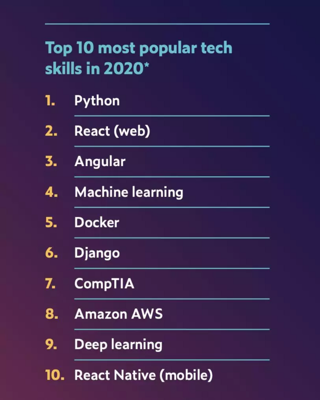

# 第六期: 9012年都快结束了，标题你来定

## 行内新闻

- [WASM 成为 HTML、CSS 与 JS 之后的第 4 门 Web 语言](https://www.oschina.net/news/111917/wasm-became-the-fourth-web-language)
- [2020 年的云世界：新联盟、无服务器和安全挑战](https://www.oschina.net/news/111915/predictions-2020-cloud)
- [5G的7大用途，你知道几个？](https://segmentfault.com/a/1190000021203423)
- [2020 IT 职场变化趋势&预测丨AI 重塑企业形态，员工要具备更多软实力，社区成为重要学习渠道...](https://segmentfault.com/a/1190000021193628)
- [迅雷 CEO 陈磊：区块链的应用前景在物联网](https://www.infoq.cn/article/jeLzoq4XNphrPQmKdyyE)

## 前端技术

Ctrl + c / v 它不香吗？

- [项目常用JS方法封装](https://juejin.im/post/5deb2cdf518825122671b637)

有没有觉得自己吹牛逼老是有心而力不足？同学，这种情况多半是~~肾不行~~（啊呸，是基础不行），请熟悉架构层的东西，它不需要998，不需要98，更不需要9.8，现在免费送了~。

- [前端防御性编程](https://juejin.im/post/5de91d0f51882512400acafd)
- [前端API层架构，也许你做得还不够](https://juejin.im/post/5de7169451882512454b18d8)

`Typescript` 到底有多难？其实我也不知道。但对于懂Java的人来说，或者对熟悉后台的面向对象语言的同学来说真的不算太难。来，每天学习一点点。

- [泛型，很多人因它放弃学习 TypeScript？](https://segmentfault.com/a/1190000021219586)
- [4000字讲清 《深入理解TypeScript》一书 【基础篇】](https://segmentfault.com/a/1190000021210413)

`ECMAScript` 都要进入2020了，这些东西你该了解了。

- [[ES6 系列] 你真的了解ES6吗(一)](https://segmentfault.com/a/1190000021207226)
- [Optional Chaining 进入 ES2020，不用满屏`x && x.yyy`了](https://www.oschina.net/news/111888/optional-chaining-moved-to-stage-4)

## 后端技术

::: tip
暂时留空~
:::
