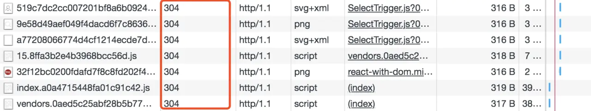

# 第二十九期: 聊聊你对http缓存的理解？有几种？分别有啥区别？

## 行内新闻

- [清华大学陈文光：为什么需要人工智能算力基准测试程序？](https://www.infoq.cn/article/D8FiGSXrOPFBt42gKOrk)
- [卡内基梅隆大学 Ruslan Salakhutdinov 教授：要将领域知识结合到机器学习中](https://www.infoq.cn/article/zH83X0zgBu4NeQAPPKwj)
- [小米雷军：人不是因为梦想大就牛 创业要顺势而为](https://tech.sina.com.cn/i/2020-06-19/doc-iircuyvi9434024.shtml)
- [100年前的这次日食，首次验证了广义相对论](https://tech.sina.com.cn/d/s/2020-06-21/doc-iircuyvi9640283.shtml)
- [为什么 Vue 更符合这个时代的大势所趋](https://xie.infoq.cn/article/251fcce4738fd632f10c4f0fc)

## 前端技术

- [前端性能优化总结](https://juejin.im/post/5ee6d90d518825434566d458)
    > 性能优化总结：减少请求次数、减小资源大小、提高响应和加载速度、优化资源加载时机、优化加载方式。

- [替代 webpack？一文带你了解 snowpack 原理，你还学得动么](https://segmentfault.com/a/1190000022985126)
    > 说实话我已经学不动了。你们加油。哈哈哈。

- [你不知道的前端异常处理（万字长文，建议收藏）](https://segmentfault.com/a/1190000022977773)

- [TypeScript中的类型断言](https://segmentfault.com/a/1190000022953966)
    > 这个断言也是一个比较常用的语法了。

- [HTTPS是如何保证安全的](https://segmentfault.com/a/1190000022950463)

- [JS数组奇巧淫技](https://juejin.im/post/5d71fff5f265da03e4678328)
    > 很实用。可以学来装B。工作中估计也不少用到。


## 后端技术

- [138 张图带你 MySQL 入门](https://juejin.im/post/5eef41b46fb9a0589567f4b8)
    > mysql 基础，可以了解一下。

- [面试急转弯：List 如何一边遍历，一边删除？](https://xie.infoq.cn/article/ce55c8a3c4d62ab565d839c9b)  
    > java的题目。

## 题外话

::: tip 面试题

```javascript
聊聊你对http缓存的理解？有几种？分别有啥区别？
```

:::


::: details 点击查看答案

HTTP 缓存一般分为两类：`强缓存（也称本地缓存）` 和 `协商缓存（也称304缓存）`。

普通刷新会启用 `协商缓存`，忽略 `强缓存`。只有在地址栏或收藏夹输入网址、通过链接引用资源等情况下，浏览器才会启用 `强缓存`。

- 强缓存（200）
    本地缓存是最快速的一种缓存方式，只要资源还在缓存有效期内，浏览器就会直接在本地读取，不会请求服务端。   

    

- 协商缓存（304）
    协商缓存，顾名思义是经过浏览器与服务器之间协商过之后，在决定是否读取本地缓存，如果服务器通知浏览器可以读取本地缓存，会返回304状态码，并且协商过程很简单，只会发送头信息，不会发送响应体。   
    

- 缓存位置
- 缓存位置一般分为：Memory Cache（内存缓存）和 Disk Cache（硬盘缓存）
    1. 内存缓存：读取快、持续时间短、容量小
    2. 硬盘缓存：读取慢、持续时间长、容量大

- 缓存优先级
    `Service Worker` -> `Memory Cache` -> `Disk Cache` -> `Push Cache`

> [答案来源掘金](https://juejin.im/post/5ee6d90d518825434566d458)
:::

